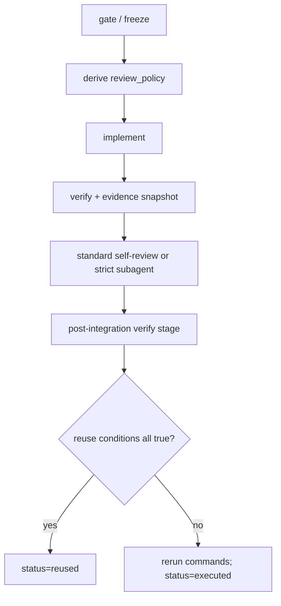

# Harness Gate Optimization Implementation Plan

> **For agentic workers:** REQUIRED SUB-SKILL: Use superpowers:subagent-driven-development (recommended) or superpowers:executing-plans to implement this plan task-by-task. Steps use checkbox (`- [ ]`) syntax for tracking.

**Goal:** 在不缩减 ISSUE 状态机与计划可读性的前提下，引入自适应评审、可复用验证证据，并拆分源仓模板回归与目标仓日常检查。

**Architecture:** 目标仓保留兼容的 `harness-check` / `harness-review-gate` 入口，新增只读 evidence snapshot helper；源仓新增独立的完整模板验证入口。Review policy 由 Goal Prompt 在 gate/freeze 阶段派生，计划结构和 review gate CLI 不变。

**Tech Stack:** POSIX shell、PowerShell、Make、Git、Markdown、Python 3（仅现有 skill helper tests）

## Global Constraints

- 不删除、合并或重命名 ISSUE、goal 或 `write_lease` 状态。
- 不删除 `.agents/PLANS.md`、计划模板、Mermaid、Reference Snippets 或 plan lint。
- `harness-review-gate` 的调用接口保持兼容，`blocking_findings` 仍是 review 内容唯一阻塞字段。
- Bash 与 PowerShell helper 输出字段和失败语义必须一致。
- 所有 evidence helper 只读 Git/repo 状态，不写工作区、不写外部系统。
- 不触碰既有未跟踪 `.idea/`，不 push、不 merge。

## 0. 现有架构回顾与核心设计决策

### 真实入口与触发

- `入口命令 / 调用源`：源仓维护者执行根级 `make verify`；初始化后的目标仓继续执行 `make harness-check` / `make harness-verify`。
- `入口代码位置`：根级 `Makefile`、`scripts/verify_harness_source.sh`、`scripts/verify_harness_source.ps1` 与 `template/Makefile`。
- `触发条件 / 上游依赖`：修改模板、初始化器或扩展源时跑 source verify；目标仓日常开发只跑 target check 以及项目自身验证。

### 输入装配与边界校验

- `输入来源`：模板源码、初始化参数、Git `HEAD` / index / worktree / untracked / submodule 状态、Goal Prompt 风险事实和 Required Verification Commands。
- `装配位置`：evidence helper 组装仓库快照；Goal Prompt 在 gate / freeze 派生 review policy；source verify 组装完整回归矩阵。
- `装配结果 / 核心对象`：`EvidenceSnapshot{head, worktree_digest, evidence_id, reusable, reason}`、`review_policy` 与分层验证结果。
- `边界校验`：unmerged、dirty submodule、读取或计算失败不可复用；旧调用没有 policy 时按 strict；required live E2E 不被本地证据替代。

### 组件职责与代码落点

| 模块/类型 | 新增/复用 | 关键产物 | 职责 | 不负责 |
| --- | --- | --- | --- | --- |
| `template/scripts/harness/evidence.*` | 新增 | `EvidenceSnapshot` | 只读计算 Git/repo 证据指纹 | 不决定是否跳过状态机阶段 |
| `template/scripts/harness/check.*` | 修改 | target check | 检查目标仓运行时关键不变量和 smoke case | 不承载完整模板文案回归 |
| `scripts/verify_harness_source.*` | 新增 | source verify | 执行模板、plan、extension、双端和初始化回归 | 不替代目标项目自身测试 |
| `control-plane.md` / Goal Prompt / prompts / guide | 修改 | review/evidence contract | 派生 reviewer 策略并约束证据复用 | 不修改 ISSUE 或 write_lease 状态枚举 |

### 关键执行时序



- `图示说明`：review owner 可自适应，但 review 与 post-integration verify 阶段都保留；证据复用只影响阶段内是否重跑确定性命令。
- `步骤化时序`：
  1. gate / freeze 根据风险与用户要求冻结 `review_policy`。
  2. 实现后按有序验证矩阵执行命令并生成 evidence snapshot。
  3. standard 由主 agent 对抗式自审，strict 由 subagent 独立评审。
  4. 进入 post-integration verify，逐项判断 session、快照、命令、仓库、writer、验证类型和 live E2E 条件。
  5. 条件全部满足时记录 reused，否则重新执行并记录 executed。
- `关键状态推进 / 数据流`：仓库事实被归一化为 evidence id，与验证上下文一起进入复用判定；ISSUE 状态机本身不变。

### 停止 / 错误 / 恢复

- `正常停止条件`：source verify、target check、策略契约测试、review gate 和独立评审均通过。
- `主要错误出口`：snapshot 失败、严格评审不可用、required live E2E 不可用、source/target contract 漂移或 plan lint 失败。
- `关键分支 / 降级路径`：任何复用条件不确定都重跑；strict reviewer 不可用时保持 `blocked: subagent_review_unavailable`；PowerShell runtime 不可用时只报告静态对齐结果。
- `恢复 / 重试 / 回滚`：测试均在临时仓运行且幂等；修复 finding 后重新执行完整验证与 review，不改变既有状态枚举。

## Reference Snippets

```text
result=ok
head=<commit-or-UNBORN>
worktree_digest=<git-object-id>
evidence_id=<git-object-id>
reusable=true|false
reason=<stable-reason>
```

```text
review_policy=standard|strict
subagent_review_required=true|false
post_integration_verify_summary.status=executed|reused
```

- `片段说明`：锁定 evidence helper 和 review/post-integration verify 的最小对外数据形状。

## Concrete Steps

### 实现步骤

1. 按 Task 1 至 Task 5 依次以测试先行实现 evidence、target check、source verify、策略契约和初始化文档同步。
2. 每个任务先验证旧行为会失败，再提交最小实现使契约转绿。
3. 最终执行完整验证、对抗式自审和独立 subagent review。

### Task 1: Verification Evidence Snapshot

**Files:**
- Create: `tests/evidence_helper_test.sh`
- Create: `template/scripts/harness/evidence.sh`
- Create: `template/scripts/harness/evidence.ps1`

**Interfaces:**
- Consumes: 当前 Git 仓库的 `HEAD`、tracked diff、untracked files、unmerged entries 与 submodule status。
- Produces: `result`、`head`、`worktree_digest`、`evidence_id`、`reusable`、`reason` 六个 `key=value` 字段。

- [x] **Step 1: 写 Bash 黑盒失败测试**
  - 在临时 Git repo 覆盖 clean、staged、unstaged、untracked、空格文件名、删除、重命名和 unborn branch。
  - 断言同一状态重复 snapshot 相同，任一受管或未忽略文件变化后 digest 改变。
  - 断言 unmerged entry 返回 `reusable=false`。

- [x] **Step 2: 运行测试并确认因 helper 缺失失败**
  - Run: `bash tests/evidence_helper_test.sh`
  - Expected: FAIL，明确报告 `template/scripts/harness/evidence.sh` 不存在。

- [x] **Step 3: 实现 Bash helper**
  - 分别使用 cached diff 与 worktree diff 覆盖 staged、unstaged、删除和重命名，避免 index 修改被工作区回退抵消。
  - 使用 `git ls-files --others --exclude-standard -z` 与 `git hash-object` 纳入 untracked 内容。
  - unborn branch 使用 `head=UNBORN`；unmerged、dirty submodule 或 snapshot 失败时保守返回不可复用。

- [x] **Step 4: 运行 Bash 测试直至通过**
  - Run: `bash tests/evidence_helper_test.sh`
  - Expected: PASS。

- [x] **Step 5: 实现同语义 PowerShell helper**
  - 参数接口固定为 `-Action Snapshot`，默认 Action 也是 `Snapshot`。
  - 输出字段、排序和不可复用原因与 Bash 版本一致。

### Task 2: Target Harness Runtime Check

**Files:**
- Create: `tests/target_check_contract_test.sh`
- Modify: `template/scripts/harness/check.sh`
- Modify: `template/scripts/harness/check.ps1`

**Interfaces:**
- Consumes: 初始化后的目标仓 base harness。
- Produces: 关键运行时不变量检查结果；成功输出 `harness check passed`。

- [x] **Step 1: 写目标仓行为失败测试**
  - 复制 `template/` 到临时目录并补齐初始化占位符。
  - 断言修改非 contract 文案后检查通过。
  - 断言缺核心文件、残留占位符、扩展 mode 混用、review gate 异常时失败。
  - 断言 evidence helper 相同状态稳定、文件变化后 fingerprint 变化。

- [x] **Step 2: 运行并确认当前重型关键词检查导致失败**
  - Run: `bash tests/target_check_contract_test.sh`
  - Expected: FAIL，非 contract 文案修改仍被当前 `required_*_patterns` 阻塞。

- [x] **Step 3: 精简 Bash target check**
  - 保留核心文件、Make targets、占位符、provider、`.gitignore`、skill frontmatter/helper、optional bundle 完整性/mode、review gate 代表性正反例和 evidence smoke。
  - 移除文案关键词矩阵、完整 plan 负例矩阵及源码级 PowerShell 文本对齐检查。

- [x] **Step 4: 对齐 PowerShell target check**
  - 保持与 Bash 相同的运行时检查集合和失败语义。

- [x] **Step 5: 运行目标仓行为测试**
  - Run: `bash tests/target_check_contract_test.sh`
  - Expected: PASS。

### Task 3: Source Repository Full Verification

**Files:**
- Create: `scripts/verify_harness_source.sh`
- Create: `scripts/verify_harness_source.ps1`
- Create: `tests/source_verify_contract_test.sh`
- Create: `Makefile`

**Interfaces:**
- Consumes: `template/`、`sources/agent_extensions/`、初始化脚本和源仓文档。
- Produces: 源仓完整回归结果；根目录 `make verify` 为 Bash 总入口。

- [x] **Step 1: 写 source verify 失败测试**
  - 断言根 `make verify` 存在并先调用 target check。
  - 断言删除关键 plan 章节、Prompt contract 或 PowerShell 对齐标志时 source verify 失败。
  - 断言临时目标仓初始化与检查成功。

- [x] **Step 2: 运行测试并确认入口缺失失败**
  - Run: `bash tests/source_verify_contract_test.sh`
  - Expected: FAIL，报告 source verify 或根 Makefile 不存在。

- [x] **Step 3: 迁移完整源码回归到 Bash source verify**
  - 从旧 target check 迁入文案/章节 contract、完整 plan 正反例、extension bundle 语义、Bash/PowerShell 静态对齐和 init dry-run/temp-target 验证。
  - 运行现有 Python helper tests。

- [x] **Step 4: 实现 PowerShell source verify**
  - 与 Bash 验证集合对齐；缺少本机 PowerShell 时 Bash 入口只报告 runtime skip，不伪报通过。

- [x] **Step 5: 接入根 Makefile 并跑回归**
  - Run: `make verify`
  - Expected: PASS，输出 target check、source contract、init smoke 和 helper test 摘要。

### Task 4: Adaptive Review Policy and Evidence Reuse Contract

**Files:**
- Modify: `template/docs/harness/control-plane.md`
- Modify: `template/.agents/skills/issue-goal-prompt/`
- Modify: `sources/agent_extensions/{full,placeholder}/.agents/`

**Interfaces:**
- Consumes: gate/freeze 风险事实、用户约束、review 能力和 verification evidence。
- Produces: `review_policy=standard|strict`、派生的 `subagent_review_required`、带 evidence id 的 verify/writeback 摘要。

- [x] **Step 1: 先添加新 contract 断言并确认失败**
  - 覆盖 standard/strict 定义、全部 strict 触发条件、风险未知回退 strict、自审 checklist、subagent unavailable blocker 和 evidence reuse/失效条件。

- [x] **Step 2: 更新控制面**
  - 保留状态枚举和转换，只补 review policy 与 `post_integration_verify_summary.status=executed|reused` 语义。

- [x] **Step 3: 更新 Goal Prompt skill/reference**
  - 生成 prompt 时明确派生 review policy；standard 允许 5.6 sol 对抗式自审，strict 保持 subagent gate。
  - Goal state 中记录 `review_policy` 和派生的 `subagent_review_required`。

- [x] **Step 4: 同步 full/placeholder Prompt 与 review guide**
  - full 版包含完整判定表和 evidence reuse 流程；placeholder 版保留入口和不可降级边界。

- [x] **Step 5: 运行 source verify**
  - Run: `make verify`
  - Expected: PASS。

### Task 5: Initializer, Documentation, and Closeout

**Files:**
- Modify: `scripts/init_harness_project.sh`
- Modify: `scripts/init_harness_project.ps1`
- Modify: `README.md`, `agent-init-project.md`, `init-harness-project-sop.md`, `template/README.md`, `template/AGENTS.md`

**Interfaces:**
- Consumes: 新增 evidence helper 与 source/target verification split。
- Produces: 新初始化仓包含 evidence helper，维护者和目标项目使用者看到不同验证入口。

- [x] **Step 1: 先扩展 source verify 的初始化产物断言并确认失败**
  - 新目标仓必须包含 Bash/PowerShell evidence helper；目标仓只运行 target check。

- [x] **Step 2: 更新 Bash/PowerShell managed files**
  - evidence helper 进入 base harness 管理清单；初始化完成后仍运行目标仓 target check。

- [x] **Step 3: 更新人类文档**
  - 明确根 `make verify` 是 harness 源仓完整回归，目标仓 `make harness-verify` 只验证 base harness 完整性，不替代项目 `make verify`。
  - 保留 plan 作为人和 agent 共用真相的定位。

- [x] **Step 4: 完整验证与对抗式自审**
  - Run: `make verify`
  - Run: `cd template && make harness-verify`
  - Run: `bash tests/evidence_helper_test.sh`
  - Run: `bash tests/target_check_contract_test.sh`
  - Run: `bash tests/source_verify_contract_test.sh`
  - Run: `git diff --check`
  - 检查最可能失败的点：旧调用兼容、untracked fingerprint、source/target contract 漂移、PowerShell 语义差异、strict 误降级。

- [x] **Step 5: 独立 subagent review**
  - 本任务命中 contract、跨脚本和兼容性 strict 条件，必须执行独立 findings-first review。
  - 修复 blocking findings 后重新跑完整验证。

## Review Summary

- `review_policy`: strict
- `review_owner`: subagent
- `blocking_findings`: none
- `fixed_findings`: index visibility flags、untracked symlink、source-template 例外旁路、根级验证矩阵缺口。
- `residual_risks`: PowerShell runtime 当前机器不可用；已完成静态对齐与独立逐段复核，真实 edge matrix 需在具备 runtime 的环境补跑。

## Validation and Acceptance

- `make verify`：通过，包含 source、evidence、target、policy 与 source-contract 回归。
- `make -C template harness-verify`：通过。
- 当前实施计划 `review_gate`：`result=pass`、`blocking_findings=none`。
- `bash -n` 与 `git diff --check`：通过。
- PowerShell：本机 runtime 不可用，只完成静态契约、双端对齐和独立评审。

## Outcomes & Retrospective

- target check 已从模板全文回归缩减为运行时关键不变量；source verify 接住完整维护回归。
- standard / strict review policy 不改变 review checkpoint 和 `blocking_findings` gate。
- evidence reuse 只减少同 session、同快照、同命令的 deterministic-local 重跑，不跳过 post-integration verify，也不替代 required live E2E。
- ISSUE 状态机、`Current State`、`Thread Status`、`write_lease`、Done Gate、计划协议与模板均未修改。
